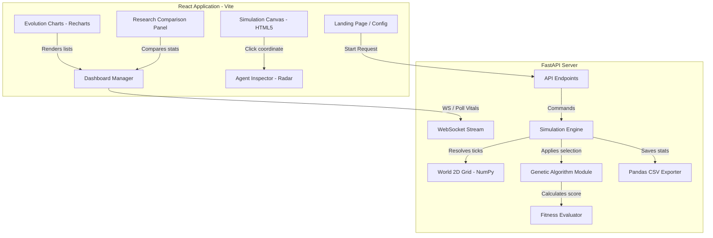
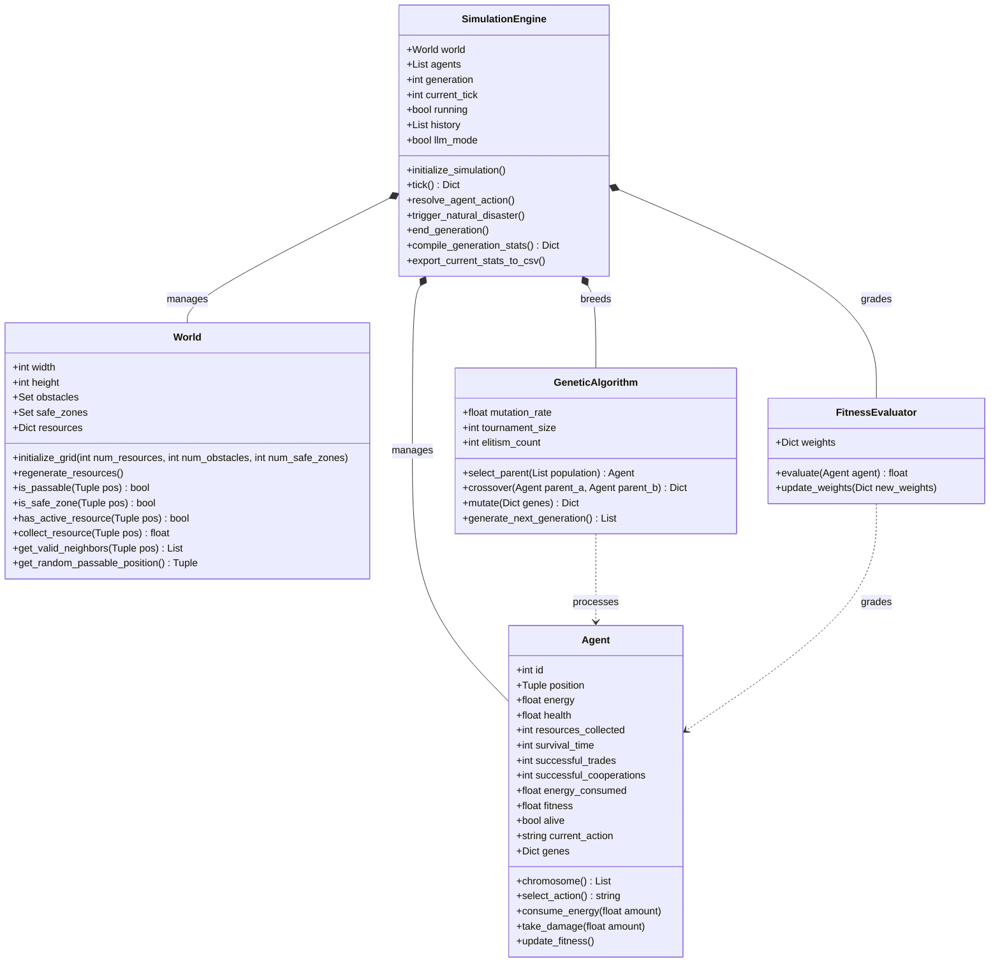

# Evolution of Artificial Personalities Using Genetic Algorithms

A futuristic, research-oriented AI multi-agent simulation that models the emergence and evolution of personality traits (genes) under various environmental pressures. This project features a FastAPI background simulation engine and a premium React + Tailwind CSS client designed with Apple's Liquid Glass interface guidelines.

---

## Technical Architecture



### UML Class Diagram



---

## Core Simulation Concept

### Personality Chromosome
Every agent is born with a chromosome containing 6 trait genes, value clamped between `0` and `100`:
1. **Aggression**: Dictates combat frequency and damage.
2. **Cooperation**: Influences group tasks and task success.
3. **Curiosity**: Drives map exploration and movement randomness.
4. **Risk Taking**: Dictates behavior when vitals are critical.
5. **Intelligence**: Enhances movement targeting towards resources.
6. **Trustworthiness**: Determines trade proposal and acceptance rates.

### Decisive Probability
Agents run a dynamic weighted action selector, evaluating surroundings (nearby threats/food) and internal energy. High-risk agents ignore low energy to hunt, whereas high-intelligence agents locate resources systematically.

---

## Research Scenarios & Hypotheses

1. **Scenario 1: Resource Abundance** ($R = 500$)
   * *Hypothesis*: Abundant resources reduce competitive necessity. Cooperation and trust genes climb, while aggression converges towards minimum thresholds.
2. **Scenario 2: Resource Scarcity** ($R = 50$)
   * *Hypothesis*: Scarcity sparks resource battles. High aggression and low trust genes dominate as competitive agents steal vital resources.
3. **Scenario 3: Natural Disasters**
   * *Hypothesis*: Instability triggers selection of balanced, risk-averse agents with high curiosity and intelligence to evade death.
4. **Scenario 4: Mixed Society (Tribes)**
   * *Hypothesis*: Co-habitation of Aggressive, Cooperative, and Balanced tribes leads to demographic splits. Promotes hybridization.

---

## Getting Started

### Prerequisites
* Python 3.12 or higher
* Node.js v18 or higher & npm

### Installation & Run Setup

#### 1. Backend Server Setup
From the workspace root directory:
```bash
# Create python virtual environment
python3 -m venv venv
source venv/bin/activate

# Install requirements
pip install -r backend/requirements.txt

# Run the FastAPI server
python3 -m uvicorn backend.main:app --host 127.0.0.1 --port 8000 --reload
```
The backend API documents will be live at `http://127.0.0.1:8000/docs`.

#### 2. Frontend client Setup
From the workspace root directory (in a new terminal tab):
```bash
cd frontend

# Install package dependencies
npm install

# Start local dev server
npm run dev
```
Open `http://localhost:5173` in your browser.

---

## API Endpoints

* `GET /simulation/start`: Launch simulation configurations (takes queries like `scenario`, `mode`, `pop_size`).
* `GET /simulation/state`: Read current grid rendering positions.
* `GET /simulation/stats`: Retrieve lists of past trait histories.
* `GET /simulation/generation`: Step ticks, toggle play/pause, adjust loop speed.
* `GET /simulation/export`: Package simulation history and matplot charts in a ZIP file.
* `WS /ws/simulation`: High-frequency streaming WebSocket socket.
