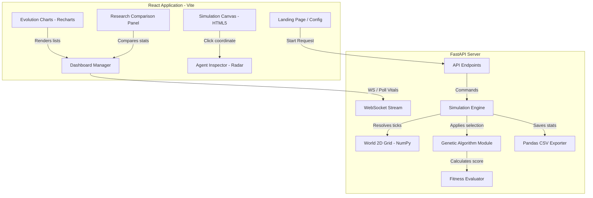

# EvoTribes

<div align="center">


**Evolution of Artificial Personalities Using Genetic Algorithms in Multi-Agent Simulations.**

[](https://reactjs.org/)
[](https://vitejs.dev/)
[](https://www.python.org/)
[](https://fastapi.tiangolo.com/)
[](https://ollama.com/)
[](https://tailwindcss.com/)

</div>

---

## Overview

**EvoTribes** is a research-oriented artificial intelligence simulation where autonomous agents evolve personality traits using Genetic Algorithms in a 2D virtual ecosystem. By combining **Evolutionary Computation**, **Multi-Agent Systems (MAS)**, and **Local LLM-based reasoning (Ollama)**, the project aims to explore which personality combinations emerge as the most successful under varying environmental scenarios (such as resource abundance or natural disasters).

Agents navigate, forage, cooperate, trade, and battle. In LLM and Hybrid modes, their decisions are formulated dynamically through local AI reasoning based on their unique personality chromosomes, vitals, and surroundings.

---

## Technical Architecture



### UML Class Diagram


---

## Features

- **Genetic Trait Evolution**: Evolve 6 genes (Aggression, Cooperation, Curiosity, Risk Taking, Intelligence, Trustworthiness) across multiple generations.
- **Dynamic Decision Engines**: Choose between rule-based weighted probabilities, pure local LLM (Ollama) reasoning, or a high-efficiency Hybrid mode.
- **Non-Blocking Inference**: Ollama requests run in background threads via an async worker pool to prevent simulation tick lags.
- **Simulated LLM Fallback**: Automatic trait-aligned reasoning generator activates if the local Ollama server is offline, keeping simulation metrics and telemetry functional.
- **Ecosystem Canvas**: Interactive HTML5 grid featuring passable grid cells, obstacles, resources, safe zones, and live health rings.
- **Evolving Statistics Charts**: Real-time generation-by-generation analytics and live tick charts plotting fitness, diversity, and average genes.
- **Three-Way Research Mode**: Compare Rule-Based, LLM-Based, and Hybrid simulations side-by-side to analyze which combinations survive best.
- **Agent Inspector Panel**: Inspect individual agents to review their age, vitals, active genes, and raw Ollama prompts & reasoning logs.
- **Disaster Scenarios**: Test societal endurance in Standard, Resource Abundance, Resource Scarcity, Mixed Tribes, and Natural Disaster settings.

---

## Prerequisites

Before you begin, ensure you have:

- **Python 3.12+** - [Download here](https://www.python.org/)
- **Node.js** (v18 or higher) - [Download here](https://nodejs.org/)
- **Ollama** (Optional, for real local LLM reasoning) - [Download here](https://ollama.com/)

---

## Installation

### 1. Clone the repository

```bash
git clone https://github.com/tharunprinz/EvoTribes.git
cd EvoTribes
```

### 2. Install backend dependencies

```bash
# Create python virtual environment
python3 -m venv venv
source venv/bin/activate

# Install requirements
pip install -r backend/requirements.txt
```

### 3. Install frontend dependencies

```bash
cd frontend
npm install
cd ..
```

---

## Configuration

### Frontend Environment Variables

Create a file named `frontend/.env` and add:

```env
VITE_API_BASE=http://localhost:8000
```

**Important Notes:**
- `VITE_API_BASE`: Point this to your backend FastAPI deployment URL (e.g. on Render) when running in production. It defaults to port `8000` on your host.

---

## Usage

### 1. Start the FastAPI backend

```bash
source venv/bin/activate
python3 -m uvicorn backend.main:app --host 127.0.0.1 --port 8000 --reload
```

The backend docs will be live at **http://127.0.0.1:8000/docs**

### 2. Start the Vite React client

In a new terminal:

```bash
cd frontend
npm run dev
```

The client will run on **http://localhost:5173**

### 3. Run a Simulation

1. Open your browser and navigate to **http://localhost:5173**
2. Choose your **Environmental Scenario** (e.g. Resource Scarcity).
3. Select your **Decision Mode** (Rule-Based, LLM, or Hybrid) and model (e.g., `qwen3:4b`).
4. Set parameters like Population Size and Generations Limit, and click **Initialize Ecosystem**.
5. Click **Play** to start, or **Step** to tick forward.
6. Click any agent to inspect active genes and reasoning logs.

---

## Project Structure

```
EvoTribes/
│
├── backend/
│   ├── api/
│   │   └── routes.py             # FastAPI simulation & socket routes
│   ├── simulation/
│   │   ├── llm/
│   │   │   ├── ollama_client.py  # Local Ollama connection client
│   │   │   ├── prompt_builder.py # Prompt builder template compiler
│   │   │   └── decision_engine.py# Decision router (Rule, LLM, Hybrid)
│   │   ├── agent.py              # Agent logic & gene statistics
│   │   ├── world.py              # World grid layout
│   │   ├── environment.py        # Scenario configurations
│   │   ├── fitness.py            # Fitness calculation logic
│   │   ├── genetic_algorithm.py  # GA crossover/mutation
│   │   └── simulation_engine.py  # Simulation tick driver & CSV logger
│   ├── tests/
│   │   ├── test_llm.py           # Unit tests for LLM client/parser
│   │   └── test_simulation.py    # Unit tests for grid/GA
│   ├── config.py                 # Global LLM settings & cooldowns
│   ├── main.py                   # FastAPI server entry point
│   └── requirements.txt          # Python package dependencies
│
├── frontend/
│   ├── src/
│   │   ├── components/
│   │   │   ├── LandingPage.jsx            # Simulation configurations page
│   │   │   ├── Dashboard.jsx              # Simulation workspace
│   │   │   ├── SimulationCanvas.jsx       # 60fps RAF canvas grid
│   │   │   ├── EvolutionChart.jsx         # Live trait Recharts
│   │   │   ├── StatsPanel.jsx             # Flash-on-update card stats
│   │   │   ├── DecisionEngineMonitor.jsx  # Telemetry, latencies, actions pie
│   │   │   ├── AgentInspectorPanel.jsx    # Genes radar, Ollama prompts log
│   │   │   ├── ResearchModePanel.jsx      # Multi-experiment side-by-side comparison
│   │   │   └── ParticleBackground.jsx     # Floating space backdrop
│   │   ├── services/
│   │   │   └── api.js                     # Fetch API client & WS handler
│   │   ├── App.jsx                        # Layout views router
│   │   ├── main.jsx                       # Entry point
│   │   └── index.css                      # Fluid glassmorphism CSS
│   ├── postcss.config.js
│   ├── tailwind.config.js
│   ├── vite.config.js
│   └── package.json
│
├── .gitignore                             # Ignore virtualenv, logs, node_modules
└── README.md
```

---

## API Endpoints

### Simulation Controller

```http
GET  /simulation/start        # Initialize new simulation
GET  /simulation/state        # Fetch live coordinates & vitals
GET  /simulation/stats        # Get completed generations stats
GET  /simulation/generation   # Control play, pause, step ticks, or speed
GET  /simulation/export      # Download ZIP with analytic plots & LLM CSV logs
```

### WebSockets Stream

```http
WS   /ws/simulation           # High-frequency coordinates broadcast
```

---

## Deployment

### Backend → Render

1. Go to [render.com](https://render.com) and create a **Web Service**.
2. Connect this repository and set **Root Directory** to `backend`.
3. Set **Build Command**: `pip install -r requirements.txt`.
4. Set **Start Command**: `uvicorn main:app --host 0.0.0.0 --port $PORT`.
5. Add environment variables if needed.
6. Deploy. Render will generate a backend endpoint URL (e.g. `https://evotribes-backend.onrender.com`).

### Frontend → Vercel

1. Go to [vercel.com](https://vercel.com) and import this repository.
2. Select the `frontend` folder as the **Root Directory**.
3. Add an Environment Variable:
   - **Key**: `VITE_API_BASE`
   - **Value**: Your Render Backend URL (no trailing slash)
4. Click **Deploy**. Vercel will automatically build the static assets.

---

## Contributing

Contributions are welcome! Please follow these steps:

1. **Fork the repository**
2. **Create a feature branch**
   ```bash
   git checkout -b feature/your-feature
   ```
3. **Commit your changes**
   ```bash
   git commit -m 'Add your feature'
   ```
4. **Push to the branch**
   ```bash
   git push origin feature/your-feature
   ```
5. **Open a Pull Request**

---

## Tech Stack

### Frontend
- **React 19** — Component structure
- **Vite 8** — Asset pipeline and builder
- **Tailwind CSS 3** — Modern fluid styling
- **Recharts** — Dynamic responsive analytics charts
- **Lucide React** — Premium UI icon vectors
- **HTML5 Canvas** — 60fps requestAnimationFrame graphics loop

### Backend
- **Python 3.12** — Core language
- **FastAPI 0.110** — Async high-performance REST/WS APIs
- **NumPy** — Rapid grid calculations
- **Pandas** — Analytical metrics exporting
- **Matplotlib** — Matplotlib static charts packaging
- **Requests** — Sync/Async Ollama requests

---

## License

This project is licensed under the **MIT License**.

---

<div align="center">

**⭐ Star this repo if you find it useful!**

**Author: [tharunprinz](https://github.com/tharunprinz)**

*Evolution of artificial personalities — Genetic Algorithms + Local Ollama*

</div>
